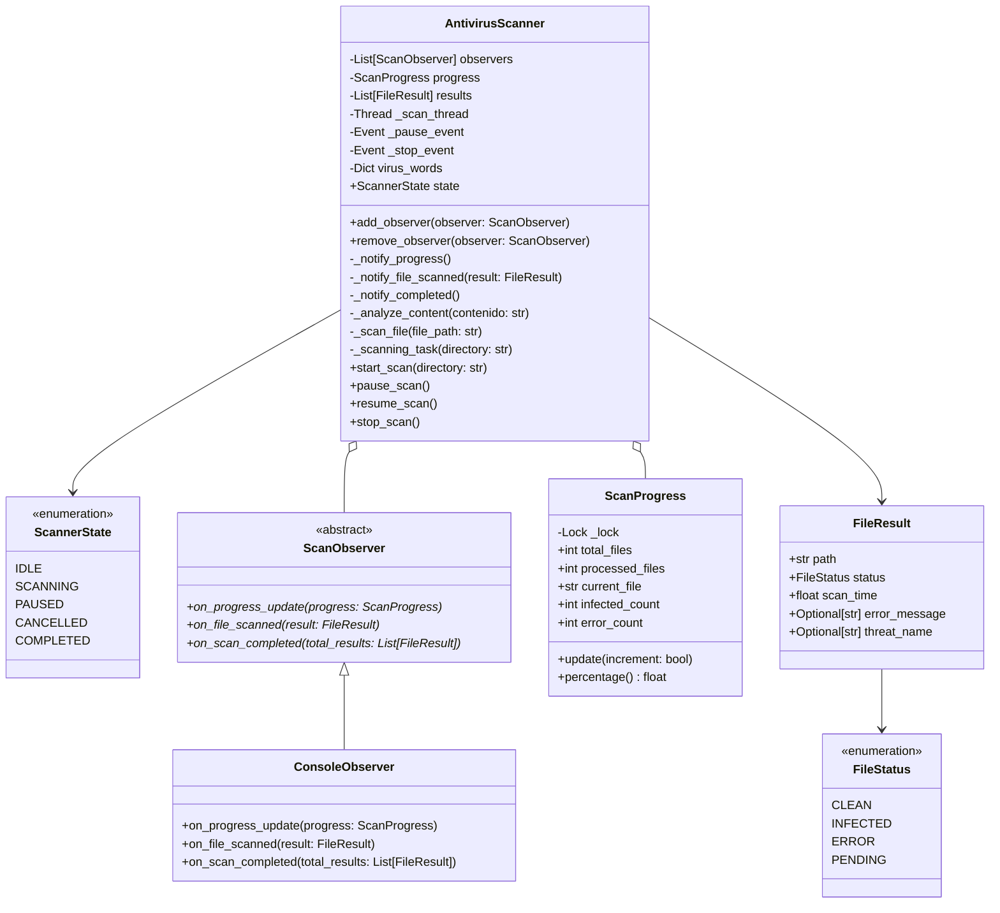
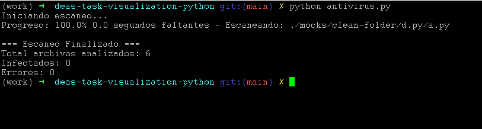
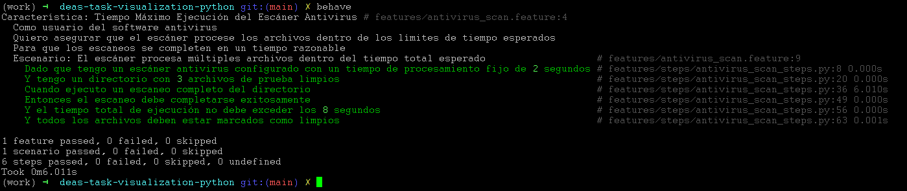

# Task visualization

Simula la ejecución de una tarea de escaneo de archivo en busca de virus.
Nos interesa hacer visible el progreso de dicha tarea para el usuario.

## Diagrama de clase 

# Ejecutar la prueba

# Ejecutar los test en Gherkin

# Dependencias

- python >= 3.11.9
- behave (solo para BDD):
    `conda install conda-forge::behave` o `pip install behave` 
